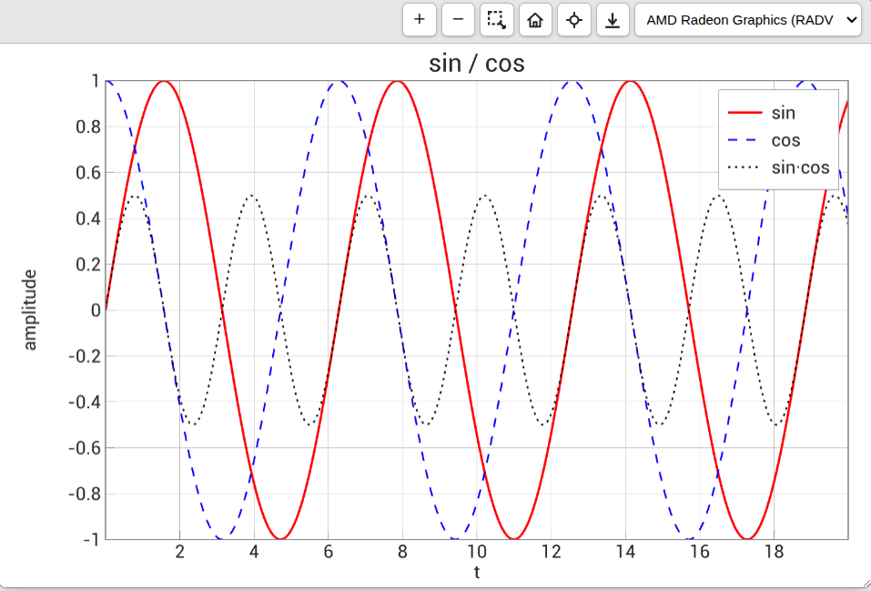
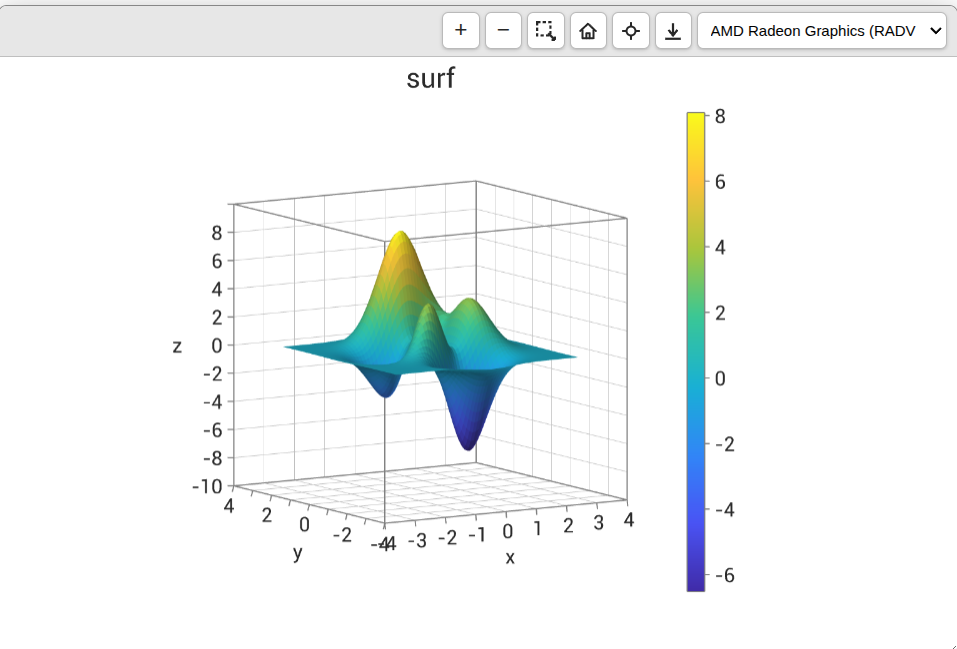

# webgpu-plot

WebGPU-accelerated 2D and 3D plotting for the browser with a MATLAB-like API.
Everything is computed and rendered on the user's GPU; there is no server component.

- 2D: `plot`, `scatter`, `hold`, `subplot`, `legend`, `xlim`/`ylim`, linked axes, 200k+ points with NaN gaps
- 3D: `plot3`, `scatter3`, `surf`, `mesh`, `contour3`, `contour`, colormaps, `colorbar`, orbit camera
- Interactive: pan, zoom, rectangle zoom, value inspector, PNG/JPEG/PDF export
- Anti-aliased vector text, no DOM or canvas 2D for drawing

> MATLAB is a registered trademark of The MathWorks, Inc. This project is not affiliated with or endorsed by MathWorks.

## Playground

Try the library in the browser, with no installation: **https://ionkrutov.github.io/webgpu_plot/**

The playground has a code editor with autocompletion, ready-made examples (2D basics, large data, surfaces, 3D curves, colormaps) and runs your code live. Each run executes in a sandboxed frame, and plots can be saved as PNG, JPEG or PDF.

## Examples

2D lines (`plot`, `hold`, `legend`):



3D surface (`surf`, `colorbar`):



## Requirements

A browser with WebGPU (Chrome/Edge 113+, recent Safari and Firefox) on a secure origin (HTTPS or `localhost`).

## Install

```sh
npm install webgpu-plot
```

```ts
import { figure, subplot, plot, surf, peaks, title } from "webgpu-plot";

figure("#chart", { width: 900, height: 600 });

subplot(1, 2, 1);
const t = Array.from({ length: 200 }, (_, i) => i / 20);
plot(t, t.map(Math.sin), "r-", { LineWidth: 2 });
title("sin");

subplot(1, 2, 2);
const { X, Y, Z } = peaks(50);
surf(X, Y, Z, { EdgeColor: "none" });
title("peaks");
```

Without a bundler, load it from a CDN:

```html
<div id="chart"></div>
<script type="module">
  import { figure, plot } from "https://cdn.jsdelivr.net/npm/webgpu-plot";
  figure("#chart");
  plot([1, 4, 2, 5]);
</script>
```

or use the global build: `<script src=".../webgpu-plot/dist/webgpu-plot.iife.js">` exposes `WebGPUPlot`.

## 3D controls

Drag to rotate, Shift-drag or right-drag to pan, wheel to zoom the data range, double-click or the Home button to reset.

## Options

```ts
import { setup, matlabStyle } from "webgpu-plot";

setup({ fontSize: 14, style: matlabStyle(), fontUrl: "/fonts/MyFont.ttf" });
```

`fontUrl` / `font` replace the bundled Roboto Regular. Object-oriented use is available through `Plotter`, `Figure`, `Axes` and `Axes3D`.

## License

MIT. The bundle includes Roboto (Apache-2.0), opentype.js (MIT) and earcut (ISC); see `THIRD_PARTY_NOTICES.md`.
